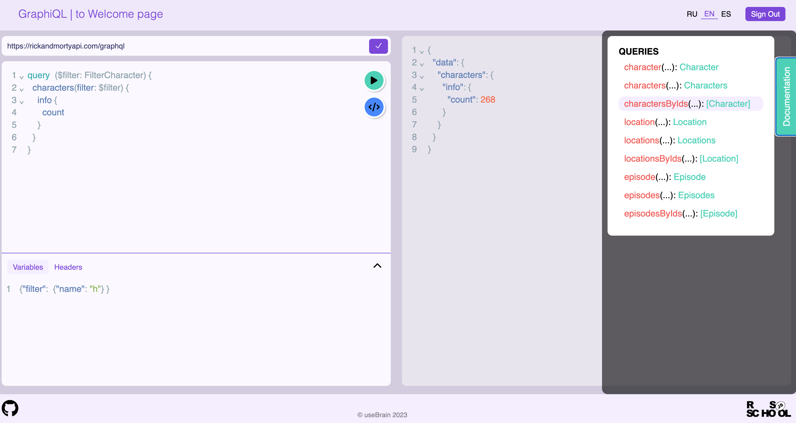

# GraphQL
GraphQL Playground is a custom application designed to facilitate the exploration and testing of GraphQL APIs. It serves as an interactive development environment that allows users to interact with GraphQL endpoints in a user-friendly and efficient manner. GraphQL Playground serves as a powerful tool for developers to iteratively build and test GraphQL queries, ensuring a smooth development process when working with GraphQL APIs.

# Application structure
- **Welcome page**
- **User auth**
- **GraphQL page with:**
  - request editor (query editor / JSON viewer)
  - variables editor
  - headers editor
  - documentation explorer (should be lazy-loaded)
  - response section (query editor / JSON viewer)
  - possibility to change to a different user-specified API endpoint

# Technical specification
The project has been implemented in accordance with [the technical specification](https://github.com/rolling-scopes-school/tasks/blob/master/react/modules/graphiql.md)

## Technology Stack:
- TypeScript
- React
- Redux Tool Kit
- Google Firebase
- Yup
- SCSS
- ESLint
- Vite
- Vitest

## Deployment
You can see the deployment of the project at [https://graphiql-app-usebrain.vercel.app/](https://graphiql-app-usebrain.vercel.app/)

## Installation and Usage
To run this project locally, follow these steps:

1. Clone this repository
2. Run 'npm i'
3. Run 'npm run dev'

## Screenshot

## Available Scripts
- **'npm run build':** This script triggers the Vite bundler to build your project in production mode. It sets the Node environment to production.
- **'npm run dev':** This script starts a development server using Vite built-in development server, allowing you to preview and test your project locally.
- **'npm run lint':** This script runs ESLint, a code analysis tool, on the code located in the src directory of your project. It automatically fixes code style and syntax issues using the --fix option, ensuring that your code conforms to defined coding standards and maintains consistency.
- **'npm run format':** This script utilizes Prettier to automatically format code in the entire project according to the defined rules.
- **'npm run coverage':** This script runs the tests using Vite's testing solution with coverage reporting enabled. It helps to assess how much of the codebase is covered by the tests.
- **'npm run preview':** This script is likely used to preview the production build locally using Vite's preview server.
- **'npm run prepare':** This script prepares the project for using Husky, a tool for Git hooks. It removes any existing Husky configuration, installs Husky, and sets up pre-commit and pre-push hooks to run lint-staged and tests, respectively, before commits and pushes.
